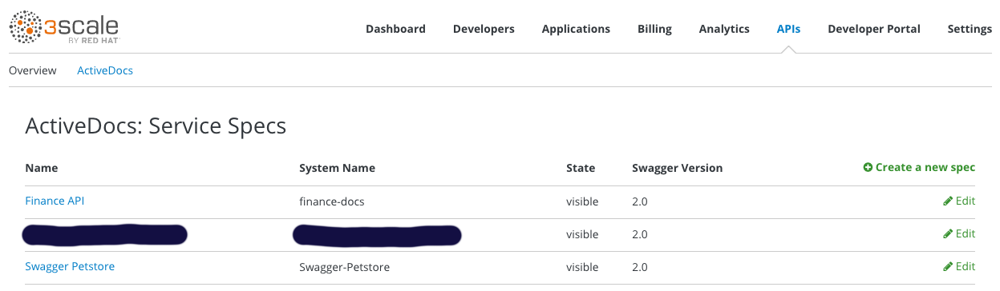

# 3scale OAS Import tool

This is a web tooling to import OAS aka Swagger specifications on 3Scale.

Currently it import:

* API definition

* Mapping Rules 

* Methods

* ActiveDocs (Swagger 2.0)

## Install on Openshift

Import the template

    oc create -f openshift/3scale-oas-importer.json -n openshift 

Create the app

    oc new-app 3scale-oas-importer

## Running Local

    npm install
    npm start run

